# 🎓 **Integrated College Management System**

> A `Java`-based system showcasing core `OOP` principles to streamline college administration tasks like managing `admins`, `students`, and `SBG` members — with persistent data storage.

---

## 📚 **Overview**

This project demonstrates `Object-Oriented Programming` concepts in `Java`:

✅ `Inheritance`  
✅ `Encapsulation`  
✅ `Abstraction`  
✅ `Polymorphism`  

It models real-world college operations such as:

- Secure `admin`/`trustee` logins  
- `Student` enrollment and management  
- `SBG` (Student Body Government) member handling  
- Persistent data storage via `CSV`/`TXT` files

---
## ✅ Some visuals
| 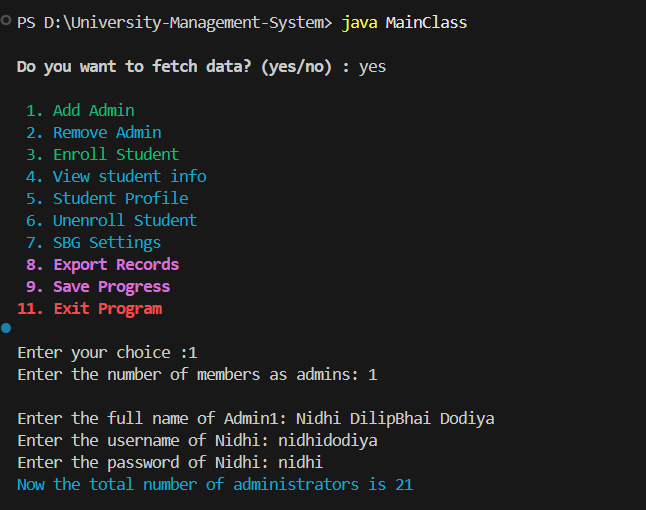 | 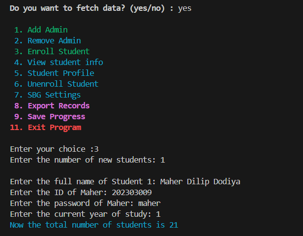 | 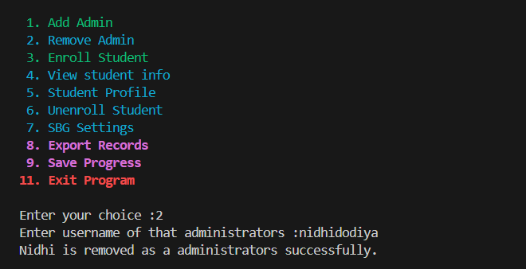 |
|:-:|:-:|:-:|
| 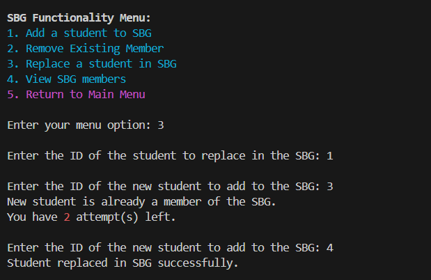 | 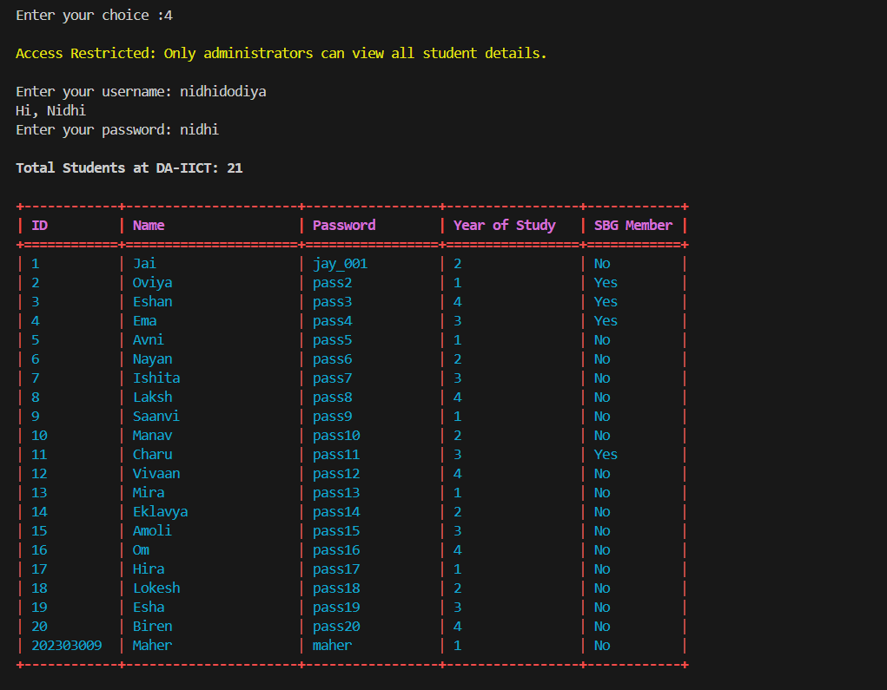 | 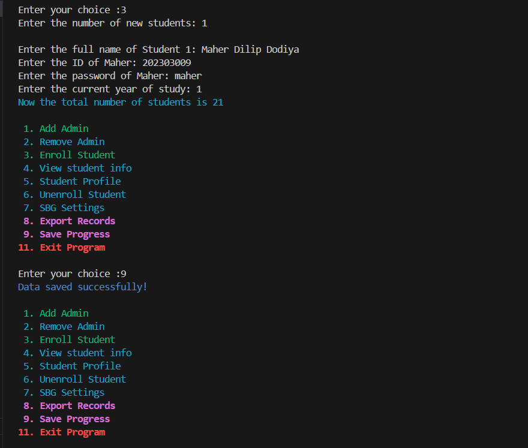 |
| 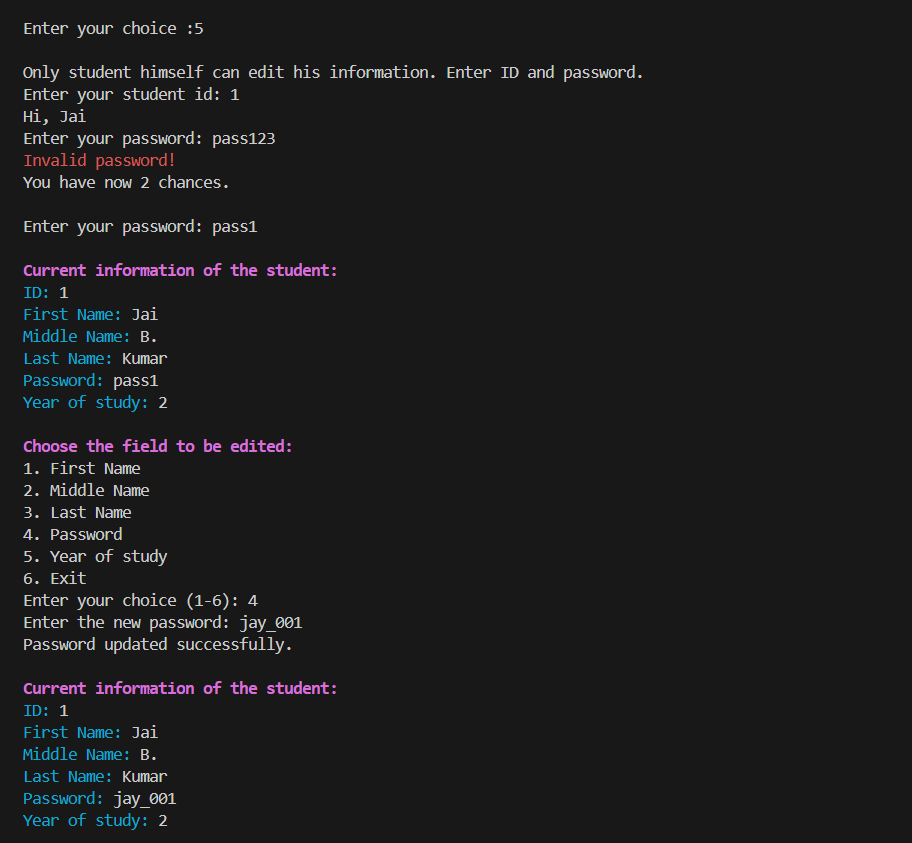 | 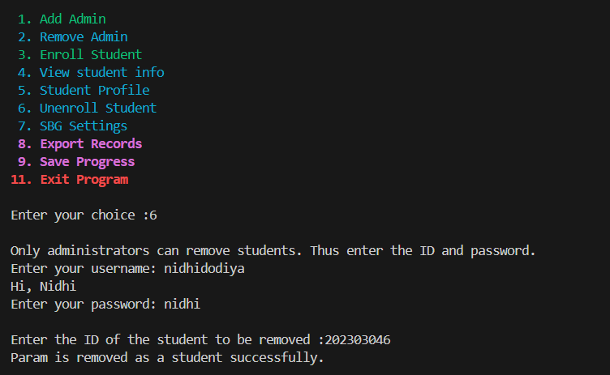 | 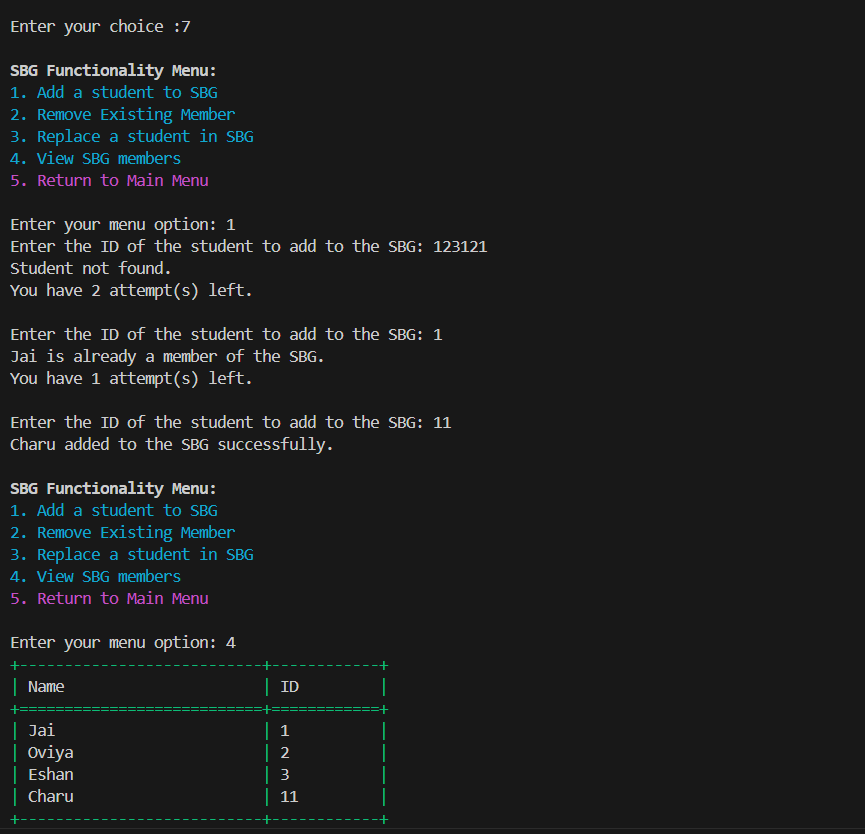 |
| 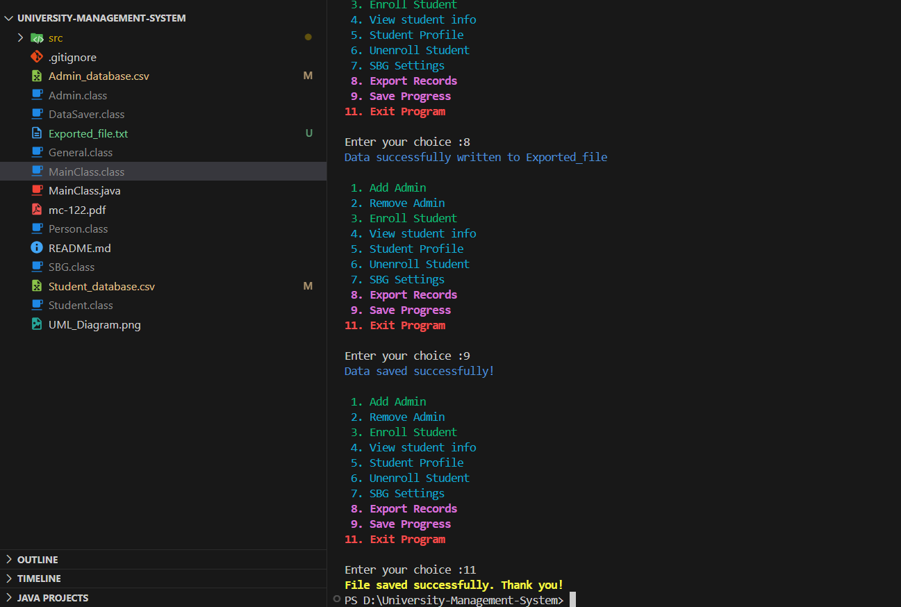 | 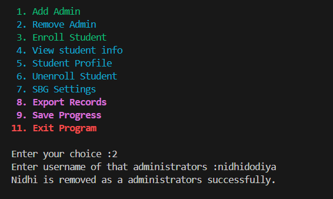 | 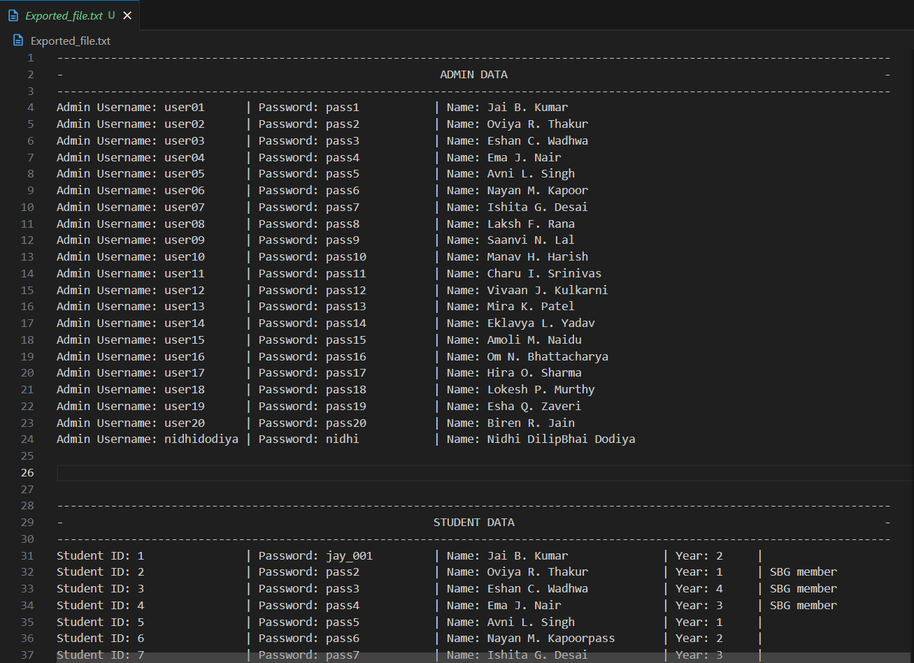 |
---

## 🚀 **Key Features**

✨ **Secure Trustee Login**  
- Encrypted credential checking  
- Prevents unauthorized access  

✨ **Admin Management**  
- Add, remove, and authenticate `admins`  
- Credential encryption for secure storage  

✨ **Student Management**  
- Enroll new `students`  
- Edit and view `student` records  
- Remove `students`  

✨ **SBG Management**  
- Add new `SBG` members  
- Remove or replace existing members  
- View current `SBG` roster  

✨ **Data Persistence**  
- Reads and writes data to `CSV`/`TXT` files  
- Ensures information is saved between sessions  

✨ **User-Friendly Console UI**  
- Color-coded output for better readability  
- Clear and interactive menus  

## 🗂️ **Project Structure**

    📦 IntegratedCollegeManagementSystem
     ┣ 📜 MainClass.java
     ┣ 📜 Admin.java
     ┣ 📜 Student.java
     ┣ 📜 Person.java
     ┣ 📜 SBG.java
     ┣ 📜 DataSaver.java
     ┗ 📜 General.java

---

## 📂 **Class Responsibilities**

| Class      | Description                                                      |
|------------|------------------------------------------------------------------|
| `General`  | Utility methods, `ANSI` color codes for styling console output   |
| `Person`   | Abstract superclass for shared properties of `Admin` and `Student` |
| `Admin`    | `Admin` management, credential encryption/validation             |
| `Student`  | `Student` record management: enroll, edit, remove, view          |
| `SBG`      | Handles `Student Body Government` members                        |
| `DataSaver`| File I/O: saving and loading data from `CSV`/`TXT`               |

---

## 🗺️ **UML Diagram**

> 📌 *Visualizing relationships between classes.*

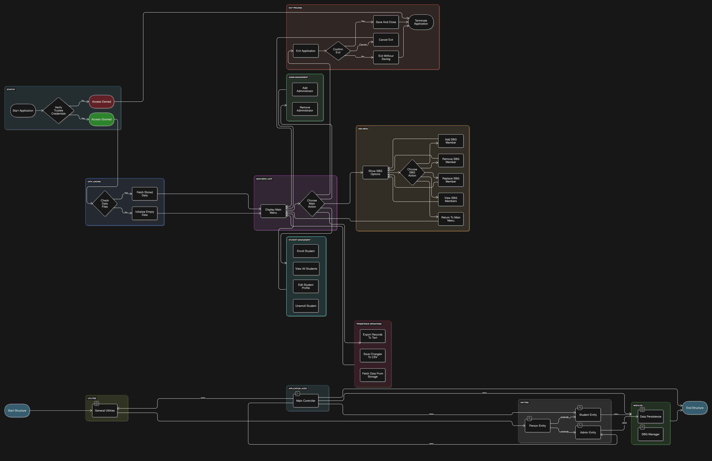

---

## 💡 **Design Highlights**

- **Encryption**: Protects `admin` credentials in storage  
- **Abstraction**: `Person` base class for shared fields  
- **Polymorphism**: Flexible object interactions for `Admin`/`Student`  
- **Separation of Concerns**: Data I/O handled in `DataSaver`  
- **User Feedback**: Colored console output improves UX  

---
## 🛠️ **Setup & Usage**

### ✅ **Prerequisites**

- `Java 8` or higher installed  
- Command-line terminal or `IDE`

### ⚙️ **Steps**

1️⃣ **Clone or download the repository**

    git clone https://github.com/NidhiDodiya1014/University-Management-System
    cd .\University-Management-System 

2️⃣ **Compile all Java files**

    javac *.java

3️⃣ **Run the main class**

    java MainClass

4️⃣ **Log in with credentials**

- **Username**: `AnilAmbani`  
- **Password**: `DhirubhaiAmbani`

5️⃣ **Navigate the console menu**  
- Choose options to manage `Admins`, `Students`, or `SBG` members

---

## 👨‍💻 **Authors**

- 👩‍🎓 `Nidhi Dodiya (202303009)`
- 👨‍🎓 `Param Savjani (202303046)`  

---

## ⚖️ **License**

> **For educational use only.**  
Feel free to study and adapt the code for learning purposes.

