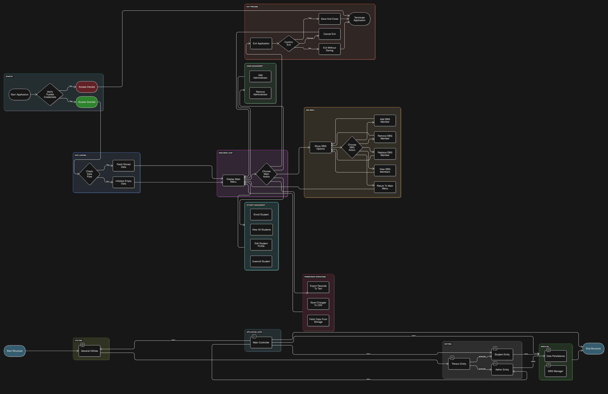

# 🎓 Integrated College Management System

## 📚 Overview

This Java-based project demonstrates OOP principles (inheritance, encapsulation, abstraction, polymorphism) to manage college operations involving admins, students, and SBG members, with persistent data storage.

## 🚀 Features

✅ Secure trustee login with encrypted credentials
✅ Admin management: add, remove, login
✅ Student management: enroll, remove, edit, view
✅ SBG management: add, remove, replace, view members
✅ Data persistence using CSV/TXT files
✅ Color-coded console outputs

## 🛠️ Setup & Usage

1️⃣ Compile Java files using `javac`
2️⃣ Run `MainClass`
3️⃣ Use credentials:

* 🔐 Username: `AnilAmbani`
* 🔑 Password: `DhirubhaiAmbani`
  4️⃣ Navigate menu to manage admins, students, and SBG

## 📂 Class Responsibilities

* `General`: Utility methods, ANSI color codes
* `Person`: Abstract base class for `Admin` and `Student`
* `Admin`: Manage admins, credential handling
* `Student`: Manage student data, editing functions
* `SBG`: Manage student body government
* `DataSaver`: Handle file read/write operations

## 📊 UML Diagram

## 📌 Future Enhancements

✨ Switch to relational database
✨ Stronger encryption
✨ Build GUI with JavaFX/Swing
✨ Enhanced role-based permissions

## 👥 Authors

👩‍🎓 Nidhi Dodiya (202303009)
👨‍🎓 Param Savjani (202303046)

## ⚖️ License

For educational purposes only.
